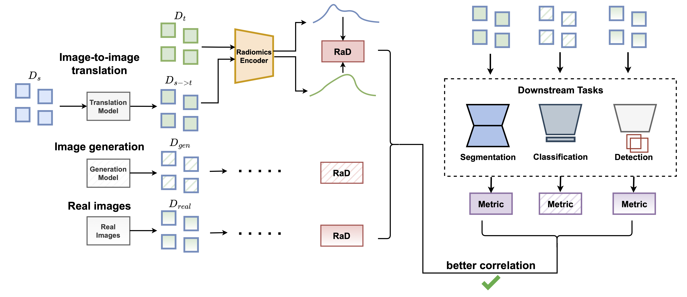

<!---[](https://pypi.org/project/frd-score/)--->
## Announcement: the FRD paper has been accepted to [Medical Image Analysis](https://www.sciencedirect.com/science/article/pii/S1361841526000125)!

# FRD (Fréchet Radiomic Distance): A Metric Designed for Medical Image Distribution Comparison in the Age of Deep Learning

#### By [Nicholas Konz*](https://nickk124.github.io/), [Richard Osuala*](https://scholar.google.com/citations?user=0KkVRVQAAAAJ&hl=en), (* = equal contribution), [Preeti Verma](https://scholar.google.com/citations?user=6WN41lwAAAAJ&hl=en), [Yuwen Chen](https://scholar.google.com/citations?user=61s49p0AAAAJ&hl=en), [Hanxue Gu](https://scholar.google.com/citations?user=aGjCpQUAAAAJ&hl=en), [Haoyu Dong](https://haoyudong-97.github.io/), [Yaqian Chen](https://scholar.google.com/citations?user=iegKFuQAAAAJ&hl=en), [Andrew Marshall](https://linkedin.com/in/andrewmarshall26), [Lidia Garrucho](https://github.com/LidiaGarrucho), [Kaisar Kushibar](https://scholar.google.es/citations?user=VeHqMi4AAAAJ&hl=en), [Daniel M. Lang](https://scholar.google.com/citations?user=AV04Hs4AAAAJ&hl=en), [Gene S. Kim](https://vivo.weill.cornell.edu/display/cwid-sgk4001), [Lars J. Grimm](https://scholars.duke.edu/person/lars.grimm), [John M. Lewin](https://medicine.yale.edu/profile/john-lewin/), [James S. Duncan](https://medicine.yale.edu/profile/james-duncan/), [Julia A. Schnabel](https://compai-lab.github.io/), [Oliver Diaz](https://sites.google.com/site/odiazmontesdeoca/home), [Karim Lekadir](https://www.bcn-aim.org/) and [Maciej A. Mazurowski](https://sites.duke.edu/mazurowski/).


arXiv paper link: [](https://arxiv.org/abs/2412.01496)

<p align="center">
  
</p>

**We recently released an updated and improved [version](frd_v1) (v1.0) of FRD in our recent [paper](https://arxiv.org/abs/2412.01496)**. The two versions' code repositories can be found below:

| FRD Version | Reference Path in Repo      | Availability as PyPi library                                               | Proposed in                                                                                                                    |
|------------|------------------|----------------------------------------------------------------------------|--------------------------------------------------------------------------------------------------------------------------------|
| v1 (v1.0)  | [frd_v1](frd_v1) | implementation in progress; update in PyPi to v1.0 will be available soon. | [Fréchet Radiomic Distance (FRD): A Versatile Metric for Comparing Medical Imaging Datasets](https://arxiv.org/abs/2412.01496) |
| v0 (v0.2)  | [frd_v0](frd_v0) | [pypi v0.2](https://pypi.org/project/frd-score/0.0.2/)                     | [Towards Learning Contrast Kinetics with Multi-Condition Latent Diffusion Models](https://arxiv.org/abs/2403.13890)            | [frd_v0](frd_v0)                                                                                                               

## Abstract
Determining whether two sets of images belong to the same or different distributions or domains is a crucial task in modern medical image analysis and deep learning; for example, to evaluate the output quality of image generative models. Currently, metrics used for this task either rely on the (potentially biased) choice of some downstream task, such as segmentation, or adopt task-independent perceptual metrics (e.g., Fréchet Inception Distance/FID) from natural imaging, which we show insufficiently capture anatomical features. To this end, we introduce a new perceptual metric tailored for medical images, FRD (Fréchet Radiomic Distance), which utilizes standardized, clinically meaningful, and interpretable image features. We show that FRD is superior to other image distribution metrics for a range of medical imaging applications, including out-of-domain (OOD) detection, the evaluation of image-to-image translation (by correlating more with downstream task performance as well as anatomical consistency and realism), and the evaluation of unconditional image generation. Moreover, FRD offers additional benefits such as stability and computational efficiency at low sample sizes, sensitivity to image corruptions and adversarial attacks, feature interpretability, and correlation with radiologist-perceived image quality. Additionally, we address key gaps in the literature by presenting an extensive framework for the multifaceted evaluation of image similarity metrics in medical imaging -- including the first large-scale comparative study of generative models for medical image translation -- and release an accessible codebase to facilitate future research. Our results are supported by thorough experiments spanning a variety of datasets, modalities, and downstream tasks, highlighting the broad potential of FRD for medical image analysis. 

## Citation

Please cite our most paper if you use our code or reference our work:

```bib
@article{konzosuala_frd2026,
  title         = {Fr\'echet Radiomic Distance (FRD): A Versatile Metric for Comparing Medical Imaging Datasets},
  author        = {Nicholas Konz* and Richard Osuala* and Preeti Verma and Yuwen Chen and Hanxue Gu and Haoyu Dong and Yaqian Chen and Andrew Marshall and Lidia Garrucho and Kaisar Kushibar and Daniel M. Lang and Gene S. Kim and Lars J. Grimm and John M. Lewin and James S. Duncan and Julia A. Schnabel and Oliver Diaz and Karim Lekadir and Maciej A. Mazurowski},
  year          = {2026},
  journal={Medical Image Analysis},
  pages={103943},
  publisher={Elsevier}
}
```
