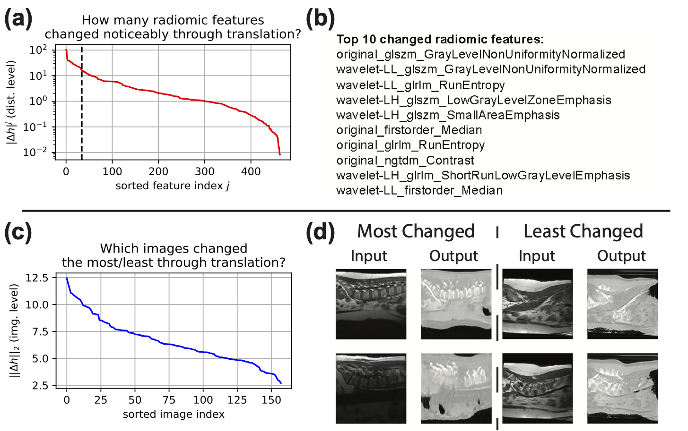

# Interpretability

FRD provides built-in tools for understanding *what* radiomic features drive the difference between two image distributions.

<p align="center">
  
</p>

## Overview

The interpretability analysis produces:

1. **Per-feature difference ranking** — which radiomic features changed the most between the two distributions (sorted by squared mean difference).
2. **t-SNE visualisation** — 2D embedding of the feature vectors, coloured by distribution.
3. **Sorted feature difference plot** — log-scale visualisation of all feature differences.

For paired datasets (same filenames in both folders), additional analyses identify which individual images changed the most.

## CLI usage

```bash
python -m frd_score path/to/dataset_A path/to/dataset_B --interpret
```

Output is written to `outputs/interpretability_visualizations/` by default. Change the output directory with `--interpret_dir`:

```bash
python -m frd_score path/to/dataset_A path/to/dataset_B \
    --interpret \
    --interpret_dir results/my_analysis/
```

## Python API

```python
from frd_score import compute_frd, interpret_frd

# Option 1: Integrated with compute_frd
frd_value = compute_frd(
    ["path/to/dataset_A", "path/to/dataset_B"],
    interpret=True,
    interpret_dir="results/interp/",
)

# Option 2: Standalone (with pre-extracted features)
results = interpret_frd(
    feature_list=[features_A, features_B],  # np.ndarray each
    feature_names=feature_names,            # list of str
    viz_dir="results/interp/",
    run_tsne=True,
)

print(results["top_changed_features"][:5])
```

### Return value

`interpret_frd()` returns a dict:

| Key | Type | Description |
|---|---|---|
| `top_changed_features` | `list[tuple[str, float]]` | Top-k features by squared mean difference |
| `n_features` | `int` | Total number of features analysed |

## Dependencies

Interpretability requires optional packages:

```bash
pip install matplotlib scikit-learn
```

If `matplotlib` is missing, `interpret_frd()` raises an `ImportError`. If `scikit-learn` is missing, t-SNE is skipped with a warning.
