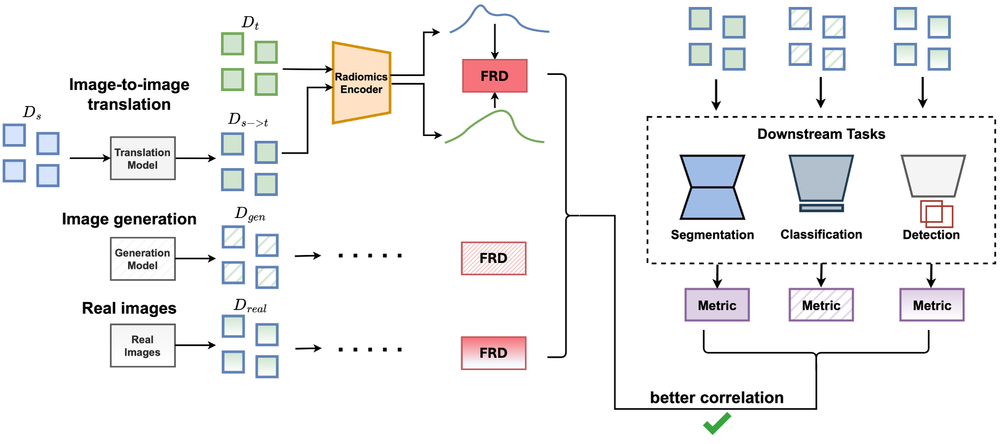
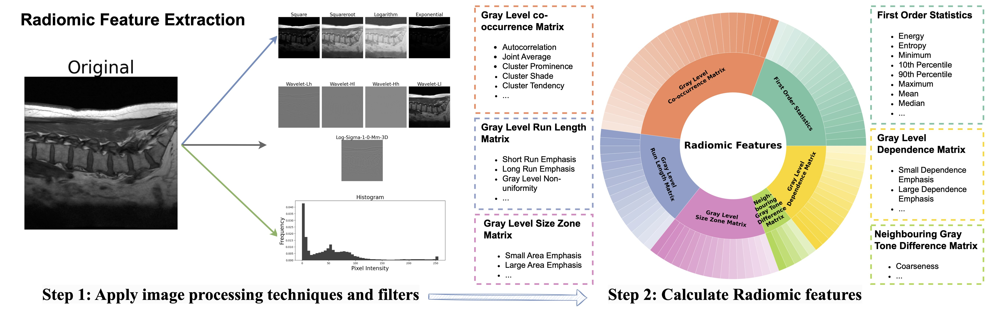

# Fréchet Radiomics Distance (FRD)

<p align="center">
  
</p>

**FRD** measures the similarity of [radiomic](https://pyradiomics.readthedocs.io/) image features between two datasets by computing the [Fréchet distance](https://en.wikipedia.org/wiki/Fr%C3%A9chet_distance) between Gaussians fitted to the extracted and normalised features.

!!! info "Key insight"
    The lower the FRD, the more similar the two datasets.

FRD supports both **2D** (PNG, JPG, TIFF, BMP) and **3D** (NIfTI `.nii.gz`) radiological images.

**[Project Website](https://richardobi.github.io/frd/)** · **[Paper (Medical Image Analysis)](https://www.sciencedirect.com/science/article/pii/S1361841526000125)** · **[arXiv](https://arxiv.org/abs/2412.01496)** · **[Evaluation Framework](https://github.com/mazurowski-lab/medical-image-similarity-metrics)**

## Why FRD?

FRD uses *standardised radiomic features* rather than pretrained deep features (FID, KID, CMMD). This yields:

1. **Better alignment** with downstream task performance (e.g. segmentation).
2. **Improved stability** and computational efficiency for small-to-moderately-sized datasets.
3. **Improved interpretability** — radiomic features are clearly defined and widely used in clinical imaging.

<p align="center">
  
</p>

## Get Started

```bash
pip install frd-score
pip install git+https://github.com/AIM-Harvard/pyradiomics.git@master
```

```python
from frd_score import compute_frd

frd_value = compute_frd(["path/to/dataset_A", "path/to/dataset_B"])
```

See the [Installation](getting-started/installation.md) and [Quick Start](getting-started/quickstart.md) guides for details.

## Citation

```bibtex
@article{konz2026frd,
    title     = {Fr\'{e}chet Radiomic Distance (FRD): A Versatile Metric for
                 Comparing Medical Imaging Datasets},
    author    = {Konz, Nicholas and Osuala, Richard and Verma, Preeti and
                 Chen, Yuwen and Gu, Hanxue and Dong, Haoyu and Chen, Yaqian
                 and Marshall, Andrew and Garrucho, Lidia and Kushibar, Kaisar
                 and Lang, Daniel M. and Kim, Gene S. and Grimm, Lars J. and
                 Lewin, John M. and Duncan, James S. and Schnabel, Julia A. and
                 Diaz, Oliver and Lekadir, Karim and Mazurowski, Maciej A.},
    journal   = {Medical Image Analysis},
    volume    = {110},
    pages     = {103943},
    year      = {2026},
    publisher = {Elsevier},
    doi       = {10.1016/j.media.2026.103943},
    url       = {https://www.sciencedirect.com/science/article/pii/S1361841526000125},
}
```
