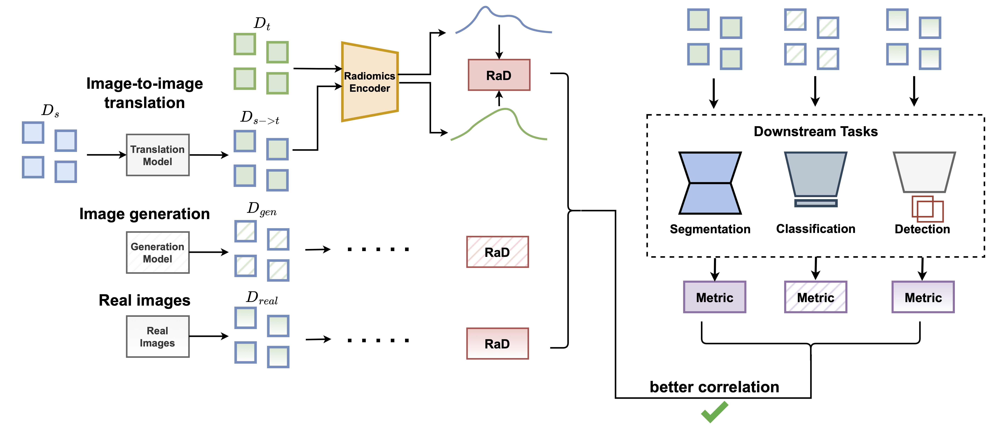
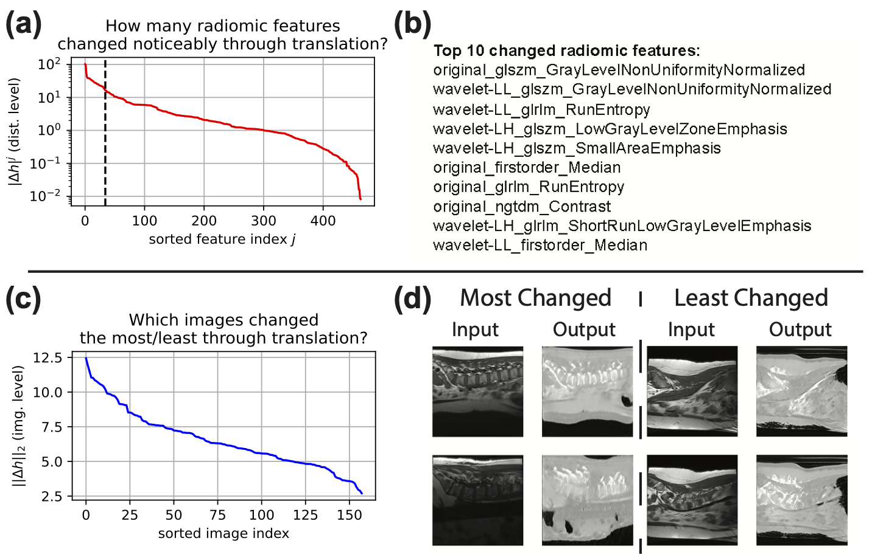

# FRD: A Metric Designed for Medical Image Distribution Comparison in the Age of Deep Learning

#### By [Nicholas Konz*](https://nickk124.github.io/), [Richard Osuala*](https://scholar.google.com/citations?user=0KkVRVQAAAAJ&hl=en), (* = equal contribution), [Preeti Verma](https://scholar.google.com/citations?user=6WN41lwAAAAJ&hl=en), [Yuwen Chen](https://scholar.google.com/citations?user=61s49p0AAAAJ&hl=en), [Hanxue Gu](https://scholar.google.com/citations?user=aGjCpQUAAAAJ&hl=en), [Haoyu Dong](https://haoyudong-97.github.io/), [Yaqian Chen](https://scholar.google.com/citations?user=iegKFuQAAAAJ&hl=en), [Andrew Marshall](https://linkedin.com/in/andrewmarshall26), [Lidia Garrucho](https://github.com/LidiaGarrucho), [Kaisar Kushibar](https://scholar.google.es/citations?user=VeHqMi4AAAAJ&hl=en), [Daniel M. Lang](https://scholar.google.com/citations?user=AV04Hs4AAAAJ&hl=en), [Gene S. Kim](https://vivo.weill.cornell.edu/display/cwid-sgk4001), [Lars J. Grimm](https://scholars.duke.edu/person/lars.grimm), [John M. Lewin](https://medicine.yale.edu/profile/john-lewin/), [James S. Duncan](https://medicine.yale.edu/profile/james-duncan/), [Julia A. Schnabel](https://compai-lab.github.io/), [Oliver Diaz](https://sites.google.com/site/odiazmontesdeoca/home), [Karim Lekadir](https://www.bcn-aim.org/) and [Maciej A. Mazurowski](https://sites.duke.edu/mazurowski/).


arXiv paper link: [](https://arxiv.org/abs/2412.01496)

Implementation adopted from [RaD repository](https://github.com/mazurowski-lab/RaD) provided by [Nicholas Konz](https://nickk124.github.io/).

<p align="center">
  
</p>

Metrics like FID are commonly used in medical image analysis to compare distributions of real and/or generated images following accepted practices in mainstream computer vision, but they may not be the best choice for medical imaging! 
Here we provide easy-to-use code for computing our proposed distance metric **FRD** (**F**réchet **R**adiomic **D**istance) version v1.0 between sets of medical images, which we introduced in our paper *Fréchet Radiomic Distance (FRD): A Versatile Metric for Comparing Medical Imaging Datasets* ([link](https://arxiv.org/abs/2412.01496)), specifically designed for the needs of medical image analysis.

### Why use FRD over FID, KID, CMMD, etc.?

FRD utilizes *standardized radiomic image features* rather than pretrained deep image features (as in commonly-used metrics like FID, KID, CMMD etc.) to compare sets of medical images. We show in our paper that this results in a number of desirable improvements for medical image distribution comparison over these prior metrics, such as:

1. Better alignment with downstream task performance (e.g., segmentation).
2. Improved stability and computational efficiency for small-to-moderately-sized datasets.
3. Improved interpretability, due to FRD utilizing features that are clearly defined and commonly used in the medical imaging community (see "**Interpreting Differences between Image Sets**" below for more).

### What can you use FRD for?

In our paper, we validate these claims through a wide range of experiments across diverse medical imaging datasets and applications, showing FRD to be a promising alternative to FID, KID, etc. for applications such as:

1. Out-of-Domain Detection (see "**Out-of-Domain (OOD) Detection**" below for more info)
2. Image-to-Image Translation Model Evaluation
3. Unconditional Generative Model Evaluation

with many other potential applications where distributions of real and/or synthetic medical images need to be compared.

<p align="center">
  
</p>

Big thanks to [Pyradiomics](https://github.com/AIM-Harvard/pyradiomics) for providing the radiomic feature computational backend for our code!

## Citation

Please cite our paper if you use our code or reference our work:

```bib
@article{konzosuala_frd2025,
      title={Fr\'echet Radiomic Distance (FRD): A Versatile Metric for Comparing Medical Imaging Datasets}, 
      author = {Konz, Nicholas and Osuala, Richard and Verma, Preeti and Chen, Yuwen and Gu, Hanxue and Dong, Haoyu and Chen, Yaqian and Marshall, Andrew and Garrucho, Lidia and Kushibar, Kaisar and Lang, Daniel M. and Kim, Gene S. and Grimm, Lars J. and Lewin, John M. and Duncan, James S. and Schnabel, Julia A. and Diaz, Oliver and Lekadir, Karim and Mazurowski, Maciej A.},
      year={2025},
      eprint={2412.01496},
      archivePrefix={arXiv},
      primaryClass={cs.CV},
      url={https://arxiv.org/abs/2412.01496}, 
}
```

## 1) Installation

1. First, note that Python <=3.9 is required due to Pyradiomics (see [here](https://github.com/AIM-Harvard/pyradiomics/issues/903)); for example, if using conda, run `conda install python=3.9`.
2. Next, please run `pip3 install -r requirements.txt` to install the required packages.

## 2) Basic Usage: Compute FRD

To compute the FRD between two sets of images, simply run the following command in the main directory:

```bash
python3 compute_frd.py \
  --image_folder1 {IMAGE_FOLDER1} \ 
  --image_folder2 {IMAGE_FOLDER2}
```

where:
- `IMAGE_FOLDER1` is the path to the first set of images.
- `IMAGE_FOLDER2` is the path to the second set of images.

For example, if you want to use FRD to compare a set of generated images to a set of real images (e.g., to evaluate some generative model), these folders correspond to the paths to the generated and real images, respectively.

#### Radiomic Feature Definitions used in FRD

Want to see the specific name of each computed radiomic feature used in FRD for the sake of interpretability? The extracted features for each provided image folder are saved as a `.csv` file in that folder, where each named column corresponds to a radiomic feature.

Additionally, you can add the argument `return_feature_names=True` to the function `convert_radiomic_dfs_to_vectors()` in `src/radiomics_utils.py`, (e.g., as used in `compute_frd.py`) to return the names of each radiomic feature in addition to the actual feature vectors of each of the two datasets where are used to compute FRD.

## Further Usage and Applications

### Out-of-Domain (OOD) Detection

#### Image-Level OOD Detection

FRD can easily be used for detecting if some newly acquired medical image is from the same domain/distribution as some reference set, e.g., comparing some image acquired at an outside hospital to a reference set used to train a downstream task model from within your own hospital. This is helpful if you're wondering if your trained model will work as well on the new data as it did from data from your own institution, or if performance may be worsened due to the new data being out-of-domain (for example, because it was acquired with a different type of scanner).

You can do this with the following command, which runs Algorithm 1 from our paper:

```bash
python3 ood_detection.py \
  --image_folder {IMAGE_FOLDER} \
  --image_folder_reference {REFERENCE_IMAGE_FOLDER}
```

where:
1. `IMAGE_FOLDER` is the path to the folder containing the test images you want to predict as being OOD or not.
2. `REFERENCE_IMAGE_FOLDER` is the path to the folder containing the reference (in-domain) images you're comparing the test images to.

The OOD detection results will be saved in a `.csv` file within `outputs/ood_predictions`, with columns of:

1. `filename` (the name of the image file)
2. `ood_score` (the unnormalized FRD OOD score of the image)
3. `ood_prediction` (the binary prediction of the image for being OOD (`pred=1`) or not (`pred=0`)), and `ood_prediction` (a binary value indicating if the image is in-domain or out-of-domain)
4. `p_value` (the p-value/probability of the image being in-domain)

#### Dataset-Level OOD Detection

Alternatively, in our paper we propose a *dataset-level* OOD detection score, $\mathrm{nFRD}_{group}$, which estimates the probability (i.e., the fraction) of the entire dataset being out-of-domain as a whole (ranges from 0 to 1). This can easily be computed via an additional command argument as:

```bash
python3 ood_detection.py \
  --image_folder {IMAGE_FOLDER} \
  --image_folder_reference {REFERENCE_IMAGE_FOLDER} \
  --dataset_level
```

### Interpreting Differences between Image Sets

You can also perform additional radiomic feature interpretability analysis to understand what specific radiomic features are driving the differences between two sets of images (for example, are these differences mostly texture-based?), and if the datasets are paired, which images are most and least changed between the two distributions according to these features. For example, this can be used to interpret how an image-to-image translation model transformed images from one domain to another (as shown in the paper):

<p align="center">
  
</p>

Which can be created easily by adding the `--interpret` argument to `compute_frd.py`, as

```bash
python3 compute_frd.py \
  --image_folder1 {IMAGE_FOLDER1} \ 
  --image_folder2 {IMAGE_FOLDER2} \
  --interpret
```

This will result in the top $k$ ($k=10$ by default) most-differing radiomic features between the two sets of images being printed out, as well as further visualizations stored in `outputs/interpretability_visualizations` which include (1) a plot of the sorted distribution of the changes for each feature between the two datasets (Fig. 7a in our paper), and (2) a t-SNE plot of the radiomic feature vectors of the two datasets.

If the two datasets are *paired* (e.g., when comparing images before and after being modified by an image-to-image translation model, as in the paper), which is detected by image pairs having the same filename in both dataset folders, the following additional analyses will be performed and outputted to `outputs/interpretability_visualizations`:

1. A plot of the sorted distribution of the changes for each image between the two datasets with respect to all radiomic features (Fig. 7c in our paper).
2. Plots showing the most- and least-changes images between the two distributions according to the radiomic features (Fig. 7d in our paper).
